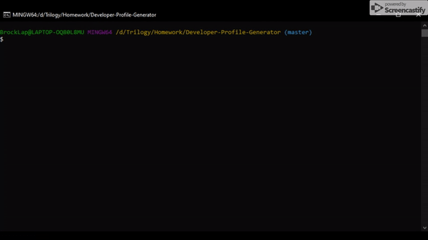

# Developer-Profile-Generator

A simple application that will create a pdf file based on information found on the users Github profile.

# How to use
<ol>
  <li>Clone this repo</li>
  <li>Run npm install</li>
  <li>Run node index.js in terminal</li>
  <li>Follow prompts</li>
</ol>

# Dependencies
<ul>
  <li>axios</li>
  <li>inquirer</li>
  <li>html-pdf</li>
</ul>
